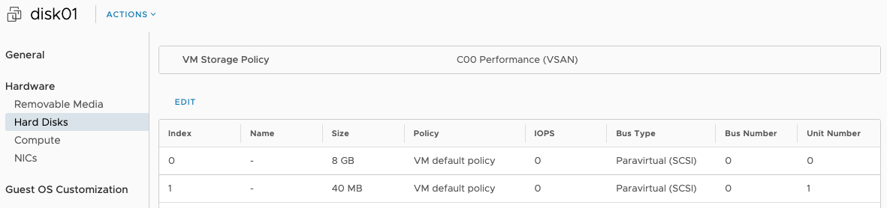
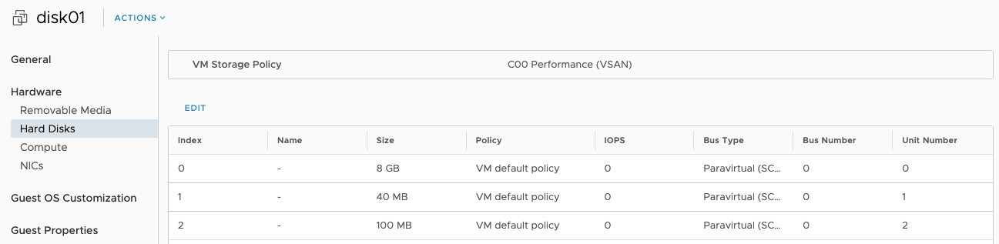
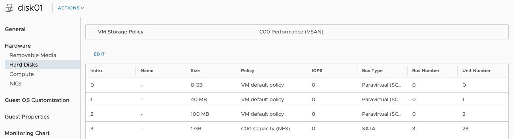

# CIVMDisks Module

CIVMDisks is a PowerShell module written to assist in manipulation of internal hard disks attached to VMware Cloud Director (VCD) virtual machines. While it is relatively easy to add new controllers and disks to a VM from the VCD UI, the commands to add/change/remove hard disks from VMs via PowerCLI are sadly lacking and this module attempts to fill this gap.

This module should be useable in all versions of VMware Cloud Director by tenants/customers to control disks attached to their VMs. In particular it has been tested against version 9.7 and 10.1 most extensively. I welcome reports from anyone able to test with other versions.

As with any code, please make sure to fully test this module in a development environment prior to using or relying on this in production. At a worst case this utility could cause the deletion of VM disks and their data so please be careful and make sure you test carefully! I've done my best to make sure that there are no serious bugs or issues in this code, but mistakes can always happen... I welcome Pull Requests (PRs) and Github issues for any problems you find.

To use the cmdlets an existing PowerCLI session to the VCD API is required (using `Connect-CIServer`).

The following cmdlets are provided by this module, each detailed in it's own section below:

| cmdlet      | Function |
| ----------- | -------- |
|[Get-CIVMDisk](#Get-CIVMDisk)| Returns an object representing the disks attached to a VM. Each disk object includes Storage Profile properties. |
|[Add-CIVMDisk](#Add-CIVMDisk)| Adds a new disk to the VM. Allows specific controller type, bus number and unit number to be set. Also allows Storage Profile and iops limit for the disk to be configured. |
|[Remove-CIVMDisk](#Remove-CIVMDisk)| Removes a disk from the VM. The VM must be powered-off to use this action. |
|[Update-CIVMDiskSize](#Update-CIVMDiskSize)| Allows resizing of an existing VM disk. |

## Pre-requisites

VCD-CIDisk requires the following:

* PowerShell version 5 or higher
* VMware PowerCLI to provide connectivity to the VCD API (`Install-Module VMware.PowerCLI`)
* An existing connection (Connect-CIServer) to the VCD API

## Installation

CIVMDisks is hosted on PowerShell Gallery and can be installed with: `Install-Module CIVMDisks`

The module code can also be downloaded from Github [here](https://github.com/jondwaite/civmdisks) and installed manually.

## License

CIVMDisks is released under the MIT open source license, see the `LICENSE` file in this repository for further details.

## Cmdlet Detail

The sections below show the parameters and usage examples for each of the provided cmdlets.

### Common Parameters

Some of the parameters used by the cmdlets are common to all modules:

| Parameter | Type | Default | Mandatory | Description |
| --------- | ---- | ------- | --------- | ----------- |
| SkipCertificateCheck | Switch | - | No | If specified this switch allows connection to VCD endpoints with unstrusted SSL certficates. This can be useful in test/dev environments but should not be used in production deployments. |
| TaskTimeout | int | 30 | No | Default timeout (in seconds) to wait for the VCD API to complete actions such as adding, removing or resizing a disk. The default of 30s has proven adequate in my testing but can be overridden here for slower environments as required. |

### Get-CIVMDisk

Retrieves an object representing the internal disks attached to the specified VM.

Parameters

| Parameter | Type | Pipeline  | Default | Mandatory | Description |
| --------- | ---- | --------- | ------- | --------- | ----------- |
| VM        | CIVMImpl | Yes | - | Yes | An object representing the VM as returned by the `Get-CIVM` cmdlet in PowerCLI |

Example

A VM with disks as shown in the VCD UI as follows:



Using the `Get-CIVMDisk` cmdlet for the same VM shows:

```powershell
PS /> $vm = Get-CIVM -Name 'disk01'
PS /> $vm | Get-CIVMDisk | Format-Table

StorageProfileName     DiskId SizeMb UnitNumber BusNumber AdapterType ThinProvisioned StorageProfile overrideVmDefault iops
------------------     ------ ------ ---------- --------- ----------- --------------- -------------- ----------------- ----
C00 Performance (VSAN) 2000   8192   0          0         paravirtual true            StorageProfile false             0
C00 Performance (VSAN) 2001   40     1          0         paravirtual true            StorageProfile false             0
```

### Add-CIVMDisk

Adds a new disk to the specified VM, optionally including specification of the exact bus type, bus number, disk number as well as storage profile and iops limit for the new disk. The cmdlet returns $true if the operation completed successfully or $false in all other cases.

Parameters

| Parameter | Type | Pipeline  | Default | Mandatory | Description |
| --------- | ---- | --------- | ------- | --------- | ----------- |
| VM        | CIVMImpl | Yes | - | Yes | An object representing the VM as returned by the `Get-CIVM` cmdlet in PowerCLI |
| DiskSize  | String | No | - | Yes | The size of the disk to be added to the VM. Suffixes 'M', 'G' and 'T' can be used to specify disk sizes - e.g. '100G', if no unit is specified the value is assumed to be in MB. |
| StorageProfile | String | No | - | No | The name of a storage profile accessible to this VM on which the new disk should be created. If not specified the disk will be created on the VM default storage profile. |
| BusType | BusTypes | No | - | No | The BusType for the new disk - must be one of 'ide', 'parallel', 'sas', 'paravirtual' or 'sata'. If not specified this will default to 'paravirtual' which is the option most commonly used. |
| BusId   | int | No | - | No | The bus number for the new disk, if this is the first disk created on this bus number then a new controller will be added if required to support this disk. Valid IDE BusIds are 0 and 1, for all other bustypes there are 4 buses available (0 to 3). Note that SATA has it's own BusIds 0-3 but 'parallel', 'sas' and 'paravirtual' share the same set of BusIds. If not specified BusId 0 will be used. |
| UnitId  | int | No | - | No | The UnitId of the new disk, valid ranges vary by controller type: IDE (0 or 1), SATA (0-30) and all others (0-15 excluding 7). Note that in some version of VCD the UI appears to let you create SATA disks at UnitId 30, but this appears to be a bug. If UnitId is not specified the module will attempt to locate the first available empty disk slot and use that for the new disk. |
| iops    | int64 | No | - | No | Restrict the disk IOPS for the new disk - this relies on the Storage Profile for the disk supporting and having IOPS limits enabled. IOPS limits are not be supported on VSAN disks. |

Example

```powershell
PS /> $vm = Get-CIVM -Name 'disk01'
PS /> $vm | Add-CIVMDisk -DiskSize 100M

Adding new disk to VM 'disk01', size:100MB type 'paravirtual' on bus:0 at UnitId:2.
Task submitted successfully.
Task Status: Running
Task Status: Running
Operation completed successfully.
True
PS /> $vm | Get-CIVMDisk | Format-Table

StorageProfileName     DiskId SizeMb UnitNumber BusNumber AdapterType ThinProvisioned StorageProfile overrideVmDefault iops
------------------     ------ ------ ---------- --------- ----------- --------------- -------------- ----------------- ----
C00 Performance (VSAN) 2000   8192   0          0         paravirtual true            StorageProfile false             0
C00 Performance (VSAN) 2001   40     1          0         paravirtual true            StorageProfile false             0
C00 Performance (VSAN) 2002   100    2          0         paravirtual true            StorageProfile false             0
```

This appears in the VCD UI after refresh as:



More complex example to add a SATA controller and disk on a specified storage profile:

```powershell
PS /> $vm = Get-CIVM -Name 'disk01'
PS /> $vm | Add-CIVMDisk -DiskSize 1G -BusType sata -BusId 3 -UnitId 29 -StorageProfile 'C00 Capacity (NFS)'

Adding new disk to VM 'disk01', size:1024MB type 'sata' on bus:3 at UnitId:29.
Task submitted successfully.
Task Status: Running
Task Status: Running
Task Status: Running
Operation completed successfully.
True
PS /> $vm | Get-CIVMDisk | Format-Table

StorageProfileName     DiskId SizeMb UnitNumber BusNumber AdapterType ThinProvisioned StorageProfile overrideVmDefault iops
------------------     ------ ------ ---------- --------- ----------- --------------- -------------- ----------------- ----
C00 Performance (VSAN) 2000   8192   0          0         paravirtual true            StorageProfile false             0
C00 Performance (VSAN) 2001   40     1          0         paravirtual true            StorageProfile false             0
C00 Performance (VSAN) 2002   100    2          0         paravirtual true            StorageProfile false             0
C00 Capacity (NFS)     16119  1024   29         3         sata        true            StorageProfile true              0
```

This appears in the VCD UI after refresh as:



### Remove-CIVMDisk

This cmdlet removes and permanently deletes a disk from a Virtual Machine. The VM must be powered-off prior to running this command as the VCD API does not permit removing a disk from a running VM. Note that the -Confirm parameter must be used to actually remove the disk.

__WARNING: ALL DATA ON THE REMOVED DISK WILL BE PERMANENTLY LOST__

Parameters

| Parameter | Type | Pipeline  | Default | Mandatory | Description |
| --------- | ---- | --------- | ------- | --------- | ----------- |
| VM        | CIVMImpl | Yes | - | Yes | An object representing the VM as returned by the `Get-CIVM` cmdlet in PowerCLI. |
| BusType | BusTypes | No | - | Yes | The type of bus on which the disk to be removed is located, valid options are: 'ide', 'parallel', 'sas', 'paravirtual' or 'sata'. |
| BusId   | int | No | - | Yes | The Id of the bus to which the disk to be removed is attached. |
| UnitId  | int | No | - | Yes | The Unit Number of the disk to be removed. |
| Confirm | switch | No | - | No | Without this switch being specified the disk will not be removed. |

The cmdlet returns $true if the deletion was able to be processed successfully, or $false in all other cases.

Due to the potential for data loss, the VM, BusType, BusId and UnitId must all be specified and the `-Confirm` switch used before a disk will be removed. The cmdlet also checks that the VM is powered-off before processing any disk removal request.

Example (removing the last disk added in the `Add-CIVMDisk` cmdlet above):

```powershell
PS /> $vm = Get-CIVM -Name 'disk01'
PS /> $vm | Remove-CIVMDisk -BusType sata -BusId 3 -UnitId 29 -Confirm

Found a disk on VM 'disk01', Controller Type 'sata' on Bus:3 at Unit:29.
-Confirm switch was specified, this disk will now be permenantly deleted.
Task submitted successfully.
Task Status: Running
Operation completed successfully.
True
```

### Update-CIVMDiskSize

The `Update-CIVMDiskSize` cmdlet allows an existing disk attached to a VM to be resized. Only increases in size are valid/permitted. Disks can be of any type, but sufficient capacity must be available in the VM's VDC to support the disk expansion.

Note: This cmdlet will __NOT__ expand partitions or filesystems contained on the expanded disk - this will need to be done using OS utilities such as `fdisk` and `growfs` (Linux) or `diskpart` on Windows. You may also need to rescan the disk structure from within the guest OS before changes made using this cmdlet are visible to the guest OS utilities.

Parameters

| Parameter | Type | Pipeline  | Default | Mandatory | Description |
| --------- | ---- | --------- | ------- | --------- | ----------- |
| VM        | CIVMImpl | Yes | - | Yes | An object representing the VM as returned by the `Get-CIVM` cmdlet in PowerCLI. |
| BusType | BusTypes | No | - | Yes | The type of bus on which the disk to be resized is located, valid options are: 'ide', 'parallel', 'sas', 'paravirtual' or 'sata'. |
| BusId   | int | No | - | Yes | The Id of the bus to which the disk to be resized is attached. |
| UnitId  | int | No | - | Yes | The Unit Number of the disk to be resized. |
| NewDiskSize | string | No | - | Yes | The new disk size for the specified VM hard disk. Suffixes 'M', 'G' and 'T' can be used to specify disk sizes - e.g. '100G', if no unit is specified the value is assumed to be in MB. |

The cmdlet returns $true if the disk resize was able to be processed successfully, or $false in all other cases.

Example

In this example, the disk at Bus:0, UnitId:2 of size 100MB in our test VM is extended to be 200M in size:

```powershell
PS /> $vm = Get-CIVM -Name 'disk01'
PS /> $vm | Update-CIVMDiskSize -BusType paravirtual -BusId 0 -UnitId 2 -NewDiskSize 200

Resizing disk on VM 'disk01' with BusType 'paravirtual' at Bus:0 and Unit:2 from 100MB to 200MB.
Task submitted successfully.
Task Status: Running
Operation completed successfully.
True
```

Note: Attempting to reduce the size of a disk will result in an error:
```powershell
PS /> $vm | Update-CIVMDiskSize -BusType paravirtual -BusId 0 -UnitId 2 -NewDiskSize 50 

Update-CIVMDiskSize: Can't reduce size of disk on VM 'disk01' with BusType 'paravirtual' at Bus:0 and Unit:2 from 200MB to 50MB, this command can only increase the size of disks, exiting.
False
```
